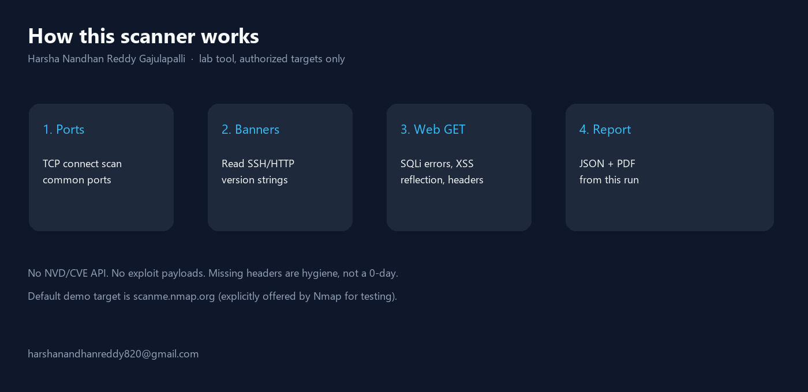
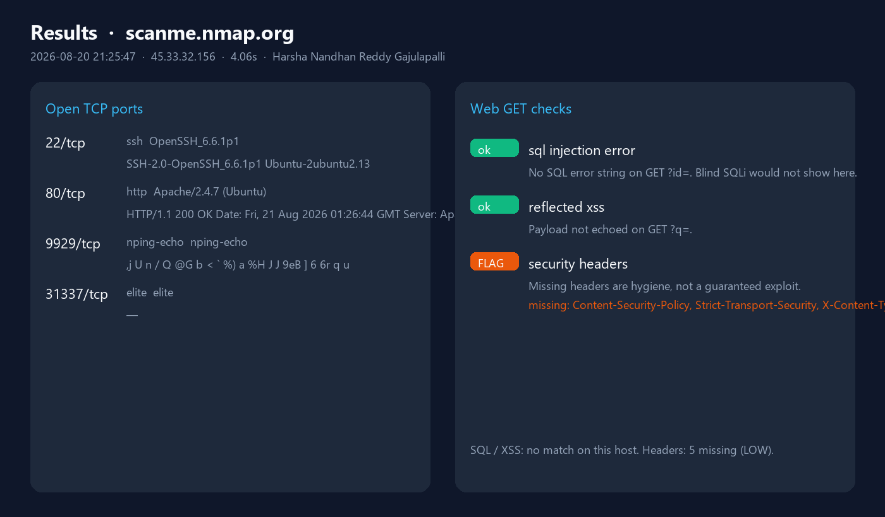

# Host Security Scanner

Lab scanner for **hosts you are allowed to test**.

It does four things:

1. TCP connect scan on a port list  
2. Banner / version grab (SSH, HTTP)  
3. Cheap web GETs: SQL error strings, reflected XSS, security headers  
4. TLS peek if 443 is open  

It does **not** look up CVEs, run Nmap NSE, or exploit anything.

Author: **Harsha Nandhan Reddy Gajulapalli**  
Email: **harshanandhanreddy820@gmail.com**



## Run

Authorized target used for the results below: [scanme.nmap.org](http://scanme.nmap.org) (Nmap’s public test host).

```bash
pip install -r requirements.txt
python scanner.py -t scanme.nmap.org --quick --json results/scanme.json --report results/scanme.pdf
python render_images.py
```

Do not point this at random internet hosts.

## Results

From a local run on 2026-08-20 against `scanme.nmap.org` (`45.33.32.156`), **4.06 seconds**, `--quick` port list.



**Open ports**

| Port | Service | What we actually read |
|---:|---|---|
| 22 | ssh | `SSH-2.0-OpenSSH_6.6.1p1 Ubuntu-2ubuntu2.13` |
| 80 | http | `Apache/2.4.7 (Ubuntu)` HTTP 200 |
| 9929 | nping-echo | binary banner |
| 31337 | elite | open, no banner |

**Web checks** (`http://scanme.nmap.org`)

| Check | Result |
|---|---|
| SQL error on `GET ?id=` | no match |
| Reflected XSS on `GET ?q=` | payload not echoed |
| Security headers | **5 missing** (CSP, HSTS, X-Content-Type-Options, X-Frame-Options, Referrer-Policy) — LOW hygiene |

No TLS: 443 was closed on this host, so the SSL module was not used in this run.

JSON: `results/scanme.json`  
PDF: `results/scanme.pdf`

A missing header is not a CVE. An empty SQLi check is not “the site is safe.”

## Layout

```
scanner.py             CLI
port_scanner.py        TCP connect + threads
service_detector.py    second banner read
web_scanner.py         GET heuristics
ssl_checker.py         TLS if 443 is open
report_generator.py    PDF from the same dict
results/               output of the scanme run
images/                diagrams built from that JSON
```

## License

MIT. Copyright (c) 2026 Harsha Nandhan Reddy Gajulapalli.
